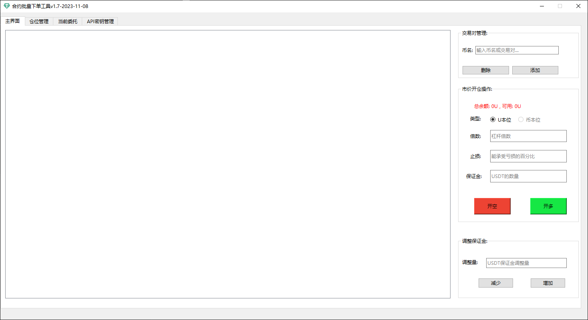
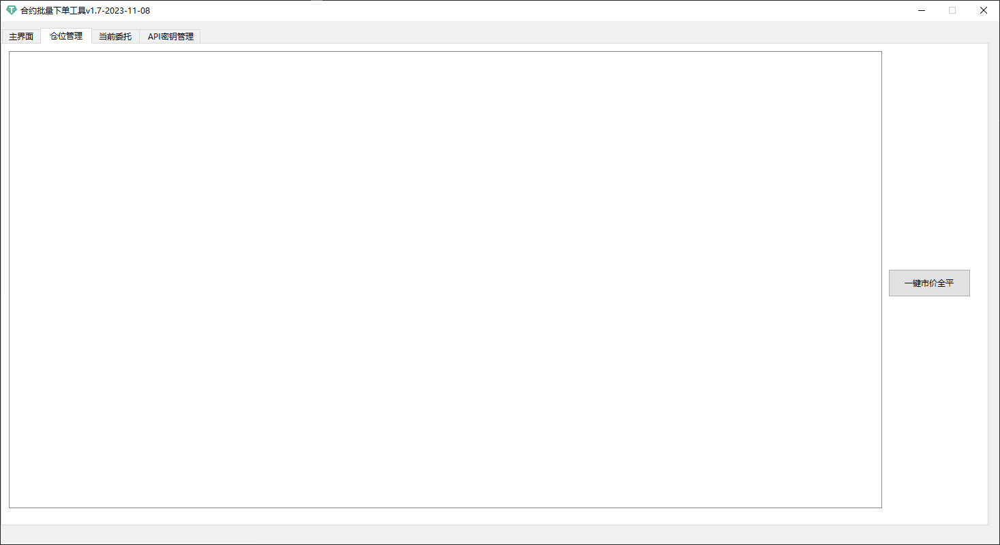

# 币安合约批量下单管理工具

API中文社区：

https://dev.binance.vision/c/api-cn/8

API文档：

https://binance-docs.github.io/apidocs/futures/cn/#api

止损市价单：

https://www.futuhk.com/hans/support/topic2_352?global_content=%7B%22promote_id%22%3A13765%2C%22sub_promote_id%22%3A10%7D

期货合约的最新价格和标记价格有何不同:

https://www.binance.com/zh-CN/blog/futures/%E6%9C%9F%E8%B4%A7%E5%90%88%E7%BA%A6%E7%9A%84%E6%9C%80%E6%96%B0%E4%BB%B7%E6%A0%BC%E5%92%8C%E6%A0%87%E8%AE%B0%E4%BB%B7%E6%A0%BC%E6%9C%89%E4%BD%95%E4%B8%8D%E5%90%8C-5704082076024731087

如何平仓：

https://dev.binance.vision/t/how-to-close-an-open-position-in-futures/4053